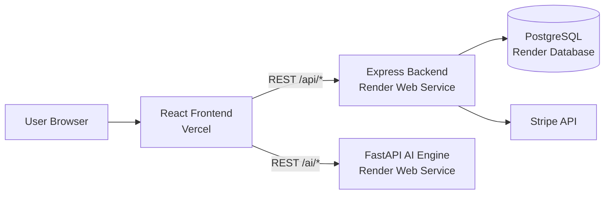
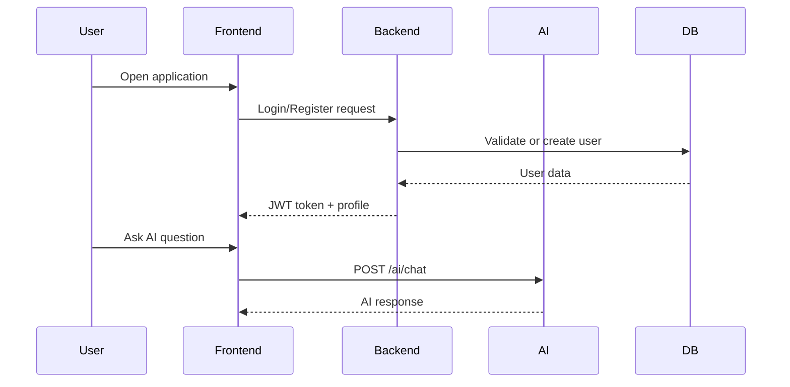
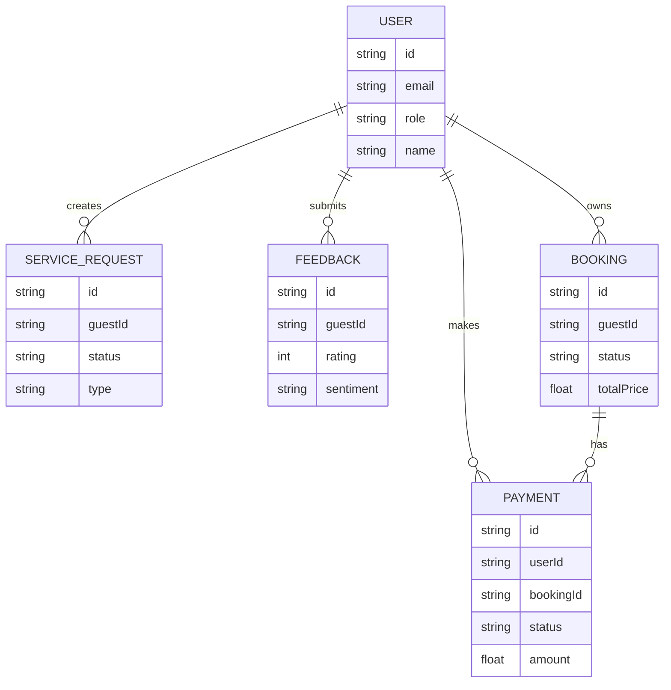

# Smart Hospitality Management

A full-stack hospitality platform for guest operations, service requests, bookings, payments, feedback analytics, and AI concierge support.

## Overview

This repository contains three applications:

- Frontend: React web application
- Backend: Node.js + Express API with Prisma and PostgreSQL
- AI Engine: FastAPI service for chat, sentiment, and knowledge-based responses

The backend and AI engine can run either together in one Docker service or as separate Render services.

## Core Features

- User authentication and role-based access (Guest, Staff, Admin)
- Service request management
- Booking management
- Stripe payment integration
- Feedback collection and analytics
- AI concierge chat
- AI sentiment analysis
- AI RAG-style hotel information responses

## Architecture



## Runtime Flow



## Repository Structure

```text
ai_services/   FastAPI AI service
backend/       Express API + Prisma
frontend/      React application
Dockerfile     Unified container build
start.sh       Unified startup script
render.yaml    Render Blueprint configuration
```

## API Surface

### Backend Routes

- /api/auth
- /api/guests
- /api/staff
- /api/requests
- /api/feedback
- /api/analytics
- /api/bookings
- /api/payments

### AI Routes (direct AI service)

- /ai/chat
- /ai/sentiment/analyze
- /ai/rag/query
- /health

## Data Model Summary



## Local Development

## 1) Backend

```bash
cd backend
npm install
npx prisma generate
npm run dev
```

## 2) AI Engine

```bash
cd ai_services
pip install -r requirements.txt
uvicorn app:app --host 0.0.0.0 --port 8001 --reload
```

## 3) Frontend

```bash
cd frontend
npm install
npm start
```

## Docker Local Run

```bash
docker build -t hospitality-api .
docker run -p 10000:10000 --env-file .env hospitality-api
```

Service endpoints:

- Backend: <http://localhost:10000/api>
- AI Service: <http://localhost:8001>

## Deployment

Use Render Blueprint with render.yaml.

### Required Render Environment Variables

- DATABASE_URL
- JWT_SECRET
- JWT_EXPIRY
- GROQ_API_KEY
- GOOGLE_API_KEY
- STRIPE_SECRET_KEY
- EMAIL_USER (optional)
- EMAIL_PASS (optional)

### Frontend Environment Variables (Vercel)

```bash
REACT_APP_API_URL=https://your-render-service.onrender.com/api
REACT_APP_AI_URL=https://your-ai-service.onrender.com
```

## Health Checks

- Backend auth check: GET /api/auth/me (expects 401 without token)
- AI health check: GET /health

## Technology Stack

- Frontend: React, React Router
- Backend: Node.js, Express, Prisma
- Database: PostgreSQL
- AI Engine: FastAPI, Groq, Gemini, Sentence Transformers, VADER
- Payments: Stripe
- Deployment: Docker, Render, Vercel

## Notes

- Backend and AI may run as separate Render services.
- Prisma migrations are executed at container start when DATABASE_URL is present.
- Frontend should call backend and AI service URLs independently.
