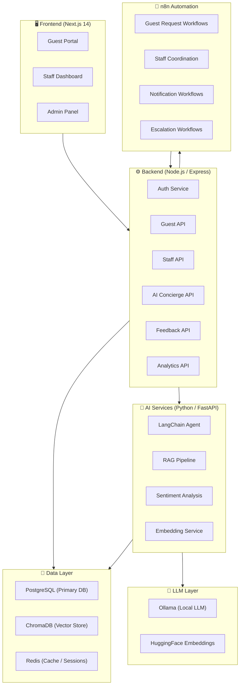
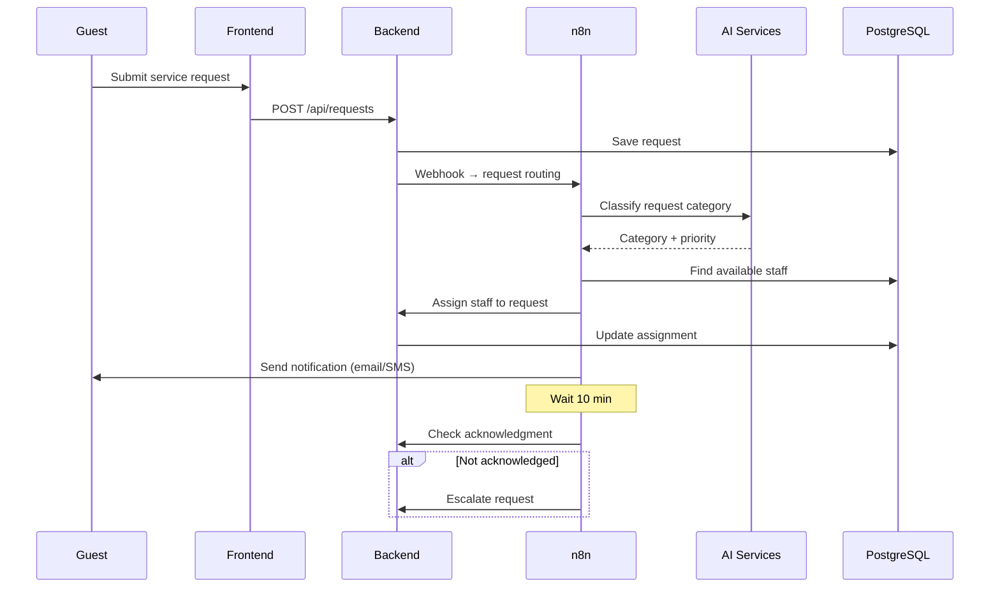
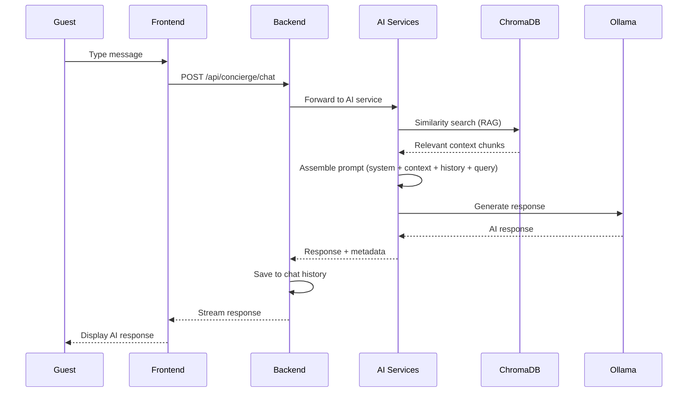
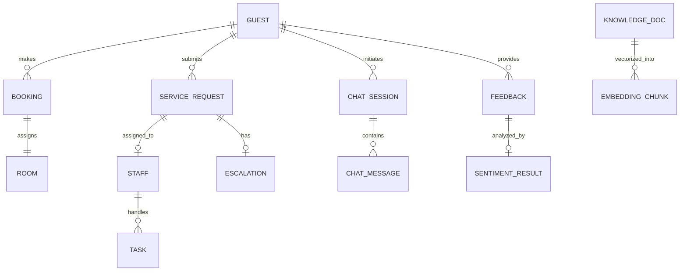

# 📐 System Architecture — Smart Hospitality Management

---

## High-Level Architecture



---

## Service Communication

| From | To | Protocol | Purpose |
|---|---|---|---|
| Frontend | Backend | HTTP REST | User actions, data CRUD |
| Backend | AI Services | HTTP REST | AI concierge, sentiment analysis |
| Backend | n8n | Webhook POST | Trigger automated workflows |
| n8n | Backend | HTTP REST | Update records, fetch data |
| AI Services | ChromaDB | HTTP | Vector store operations |
| AI Services | Ollama | HTTP | LLM inference |
| Backend | PostgreSQL | TCP (Prisma) | Data persistence |
| Backend | Redis | TCP | Session cache, rate limiting |

---

## Data Flow: Guest Request



---

## Data Flow: AI Concierge Chat



---

## Database Schema (ER Diagram)



---

## Port Mapping

| Service | Port | Description |
|---|---|---|
| Frontend (Next.js) | 3000 | Guest, Staff, Admin UI |
| Backend (Express) | 4000 | REST API |
| AI Services (FastAPI) | 8000 | AI/ML endpoints |
| PostgreSQL | 5432 | Primary database |
| Redis | 6379 | Cache & sessions |
| ChromaDB | 8100 | Vector database |
| n8n | 5678 | Workflow automation |
| Ollama | 11434 | Local LLM |
| Prisma Studio | 5555 | DB admin UI (dev only) |

---

## Security Architecture

```
┌─────────────────────────────────────────────┐
│                  Frontend                    │
│  (HTTPS, CSRF prevention, input sanitizing) │
└──────────────────┬──────────────────────────┘
                   │ JWT Bearer Token
┌──────────────────▼──────────────────────────┐
│                  Backend                     │
│  ┌─────────┐ ┌──────────┐ ┌──────────────┐ │
│  │  CORS   │ │ Rate     │ │ JWT Auth +   │ │
│  │ Filter  │ │ Limiter  │ │ Role Check   │ │
│  └─────────┘ └──────────┘ └──────────────┘ │
│  ┌─────────┐ ┌──────────┐ ┌──────────────┐ │
│  │ Helmet  │ │ Zod      │ │ bcrypt       │ │
│  │ Headers │ │ Validate │ │ Password Hash│ │
│  └─────────┘ └──────────┘ └──────────────┘ │
└─────────────────────────────────────────────┘
```
