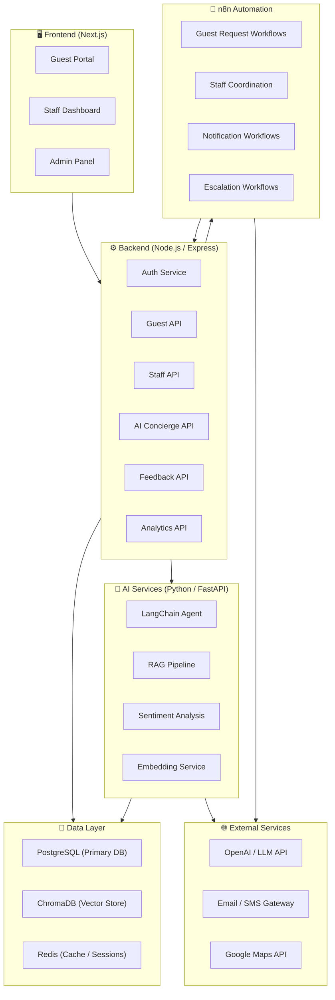
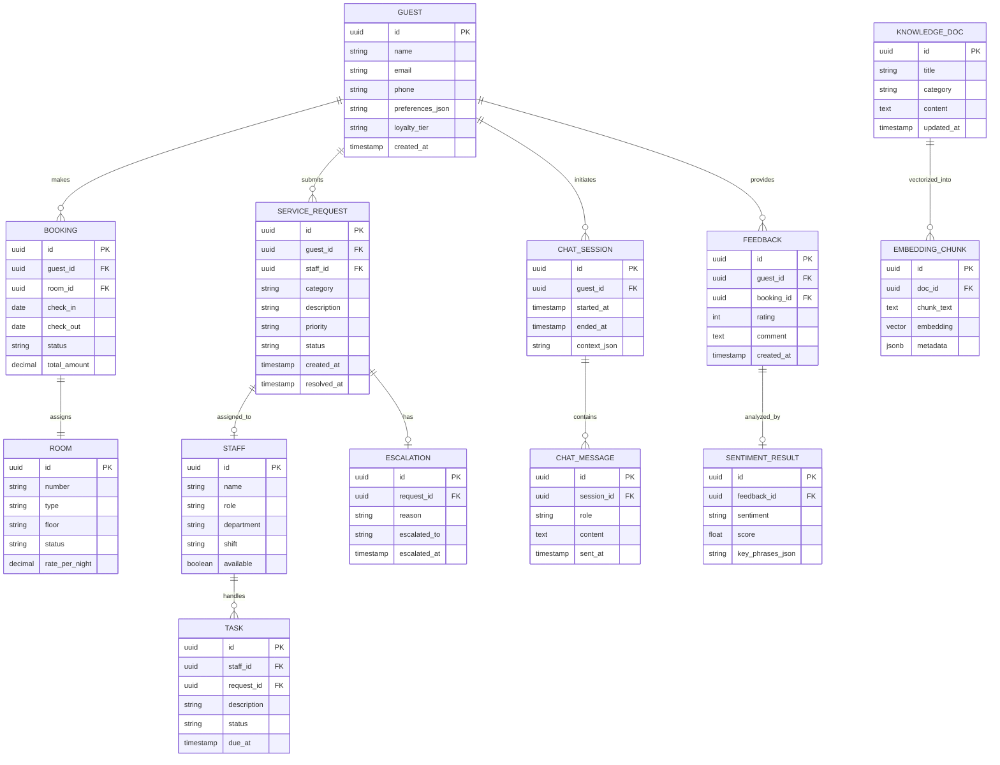
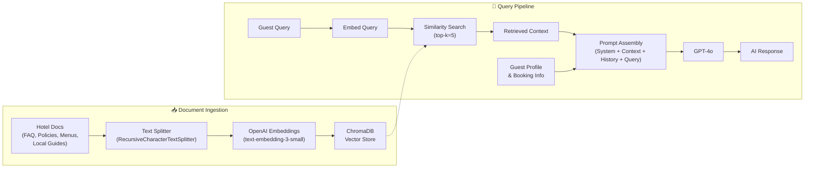
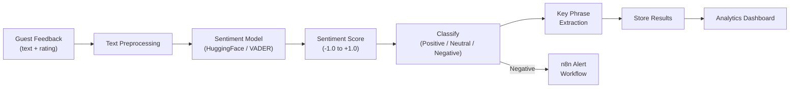
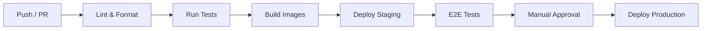

# 🏨 AI-Powered Smart Hospitality Management System — Implementation Plan

> **Project Goal:** Build an intelligent hospitality management platform that integrates AI concierge services, automated workflows, RAG-based knowledge retrieval, sentiment analysis, and CI/CD pipelines to enhance guest experience and operational efficiency.

---

## 📐 System Architecture Overview



---

## 🛠️ Technology Stack

| Layer | Technology | Purpose |
|---|---|---|
| **Frontend** | Next.js 14 (App Router) | Guest portal, staff dashboard, admin panel |
| **UI Framework** | Vanilla CSS + Custom Design System | Premium, modern UI |
| **Backend API** | Node.js + Express.js | REST API, business logic, auth |
| **AI Services** | Python + FastAPI | LangChain agent, RAG, sentiment analysis |
| **LLM Framework** | LangChain | Orchestration of LLM calls, tool usage, chains |
| **LLM Provider** | OpenAI GPT-4 / GPT-4o | Natural language understanding & generation |
| **Vector Database** | ChromaDB | Storing & querying document embeddings |
| **Embeddings** | OpenAI `text-embedding-3-small` | Vectorizing hotel knowledge base |
| **Primary Database** | PostgreSQL | Guest data, bookings, requests, staff |
| **Cache / Sessions** | Redis | Session management, caching, rate limiting |
| **Automation** | n8n (self-hosted) | Workflow automation, staff coordination |
| **Sentiment Analysis** | HuggingFace Transformers / VADER | Guest feedback sentiment scoring |
| **CI/CD** | GitHub Actions | Automated testing, linting, deployment |
| **Containerization** | Docker + Docker Compose | Local dev & production deployment |
| **Monitoring** | Winston + Prometheus + Grafana | Logging, metrics, alerting |

---

## 📁 Project Folder Structure

```
Smart Hospitality Management/
├── .github/
│   └── workflows/
│       ├── ci.yml                    # Lint, test, build
│       ├── cd-staging.yml            # Deploy to staging
│       └── cd-production.yml         # Deploy to production
│
├── frontend/                         # Next.js 14 App
│   ├── app/
│   │   ├── (guest)/                  # Guest-facing pages
│   │   │   ├── concierge/            # AI Chat interface
│   │   │   ├── requests/             # Service requests
│   │   │   ├── feedback/             # Feedback submission
│   │   │   └── explore/              # Local recommendations
│   │   ├── (staff)/                  # Staff dashboard
│   │   │   ├── dashboard/            # Overview & alerts
│   │   │   ├── requests/             # Manage guest requests
│   │   │   └── coordination/         # Team coordination
│   │   ├── (admin)/                  # Admin panel
│   │   │   ├── analytics/            # Sentiment & ops analytics
│   │   │   ├── knowledge-base/       # Manage RAG documents
│   │   │   └── settings/             # System settings
│   │   ├── layout.js
│   │   └── page.js                   # Landing / login
│   ├── components/
│   │   ├── ui/                       # Design system components
│   │   ├── chat/                     # AI chat components
│   │   ├── dashboard/                # Dashboard widgets
│   │   └── common/                   # Shared components
│   ├── lib/                          # Utilities, API client
│   ├── styles/                       # CSS design system
│   │   ├── globals.css
│   │   ├── design-tokens.css
│   │   └── components/
│   ├── public/                       # Static assets
│   ├── package.json
│   └── next.config.js
│
├── backend/                          # Node.js Express API
│   ├── src/
│   │   ├── config/                   # DB, Redis, env config
│   │   ├── middleware/               # Auth, rate-limit, error handling
│   │   ├── routes/
│   │   │   ├── auth.routes.js
│   │   │   ├── guest.routes.js
│   │   │   ├── staff.routes.js
│   │   │   ├── concierge.routes.js
│   │   │   ├── feedback.routes.js
│   │   │   └── analytics.routes.js
│   │   ├── controllers/
│   │   ├── services/
│   │   ├── models/                   # Sequelize / Prisma models
│   │   ├── utils/
│   │   └── app.js
│   ├── prisma/
│   │   └── schema.prisma             # Database schema
│   ├── tests/
│   ├── package.json
│   └── Dockerfile
│
├── ai-services/                      # Python FastAPI
│   ├── app/
│   │   ├── main.py                   # FastAPI entry
│   │   ├── routers/
│   │   │   ├── concierge.py          # AI concierge endpoints
│   │   │   ├── rag.py                # RAG query endpoints
│   │   │   └── sentiment.py          # Sentiment analysis endpoints
│   │   ├── services/
│   │   │   ├── langchain_agent.py    # LangChain agent setup
│   │   │   ├── rag_pipeline.py       # RAG ingestion & retrieval
│   │   │   ├── embedding_service.py  # Embedding generation
│   │   │   └── sentiment_analyzer.py # Sentiment scoring
│   │   ├── knowledge_base/           # Hotel docs, FAQs, policies
│   │   ├── prompts/                  # System prompts & templates
│   │   ├── models/                   # Pydantic schemas
│   │   └── config.py
│   ├── tests/
│   ├── requirements.txt
│   └── Dockerfile
│
├── n8n/                              # n8n Workflow Automation
│   ├── workflows/
│   │   ├── guest-request-routing.json
│   │   ├── staff-assignment.json
│   │   ├── escalation-handler.json
│   │   ├── feedback-processor.json
│   │   └── notification-dispatcher.json
│   ├── credentials/                  # (gitignored) n8n credentials
│   └── docker-compose.n8n.yml
│
├── docker-compose.yml                # Full stack orchestration
├── docker-compose.dev.yml            # Dev overrides
├── .env.example
├── README.md
└── docs/
    ├── architecture.md
    ├── api-reference.md
    ├── setup-guide.md
    └── n8n-workflows.md
```

---

## 💾 Database Schema (Core Entities)



---

## 🔄 n8n Workflow Designs

### Workflow 1: Guest Request Routing
```
Trigger (Webhook: new request)
  → Classify request category (AI classification)
  → Determine priority level
  → Find available staff by department
  → Assign staff member
  → Send notification to staff (push + email)
  → Update request status in DB
  → If not acknowledged in 10 min → Escalate
```

### Workflow 2: Staff Coordination
```
Trigger (Scheduled: every 5 min)
  → Check pending requests
  → Check staff availability & workload
  → Rebalance assignments if needed
  → Notify managers of bottlenecks
  → Log coordination metrics
```

### Workflow 3: Feedback Processor
```
Trigger (Webhook: new feedback)
  → Call Sentiment Analysis API
  → Store sentiment result
  → If negative (score < -0.5)
    → Create urgent alert
    → Notify front desk manager
    → Trigger follow-up workflow
  → Aggregate daily sentiment summary
```

### Workflow 4: Escalation Handler
```
Trigger (Webhook: escalation event)
  → Determine escalation level
  → Notify appropriate manager
  → Create escalation record
  → If Level 3+ → Notify GM
  → Track resolution time
```

### Workflow 5: Notification Dispatcher
```
Trigger (Webhook: notification request)
  → Determine channel (email / SMS / push / in-app)
  → Format message from template
  → Send via appropriate gateway
  → Log delivery status
  → Retry on failure (max 3)
```

---

## 🤖 AI Concierge — RAG Pipeline Design



### Concierge Capabilities
| Capability | Description |
|---|---|
| **Hotel Info** | Room amenities, check-in/out times, policies, facilities |
| **Local Recommendations** | Restaurants, attractions, transportation (via knowledge base + Maps API) |
| **Service Requests** | Trigger housekeeping, maintenance, room service via tools |
| **Booking Queries** | Check reservation details, modify requests |
| **Personalized Suggestions** | Based on guest preferences, loyalty tier, and stay history |
| **Multi-turn Conversation** | Maintains chat history per session for context-aware responses |

---

## 📊 Sentiment Analysis Pipeline



---

## 🚀 CI/CD Pipeline (GitHub Actions)



### Pipeline Jobs

| Job | Trigger | Actions |
|---|---|---|
| **Lint & Format** | Every PR | ESLint, Prettier, Ruff (Python) |
| **Unit Tests** | Every PR | Jest (backend), Pytest (AI services) |
| **Build** | Merge to `main` | Docker build & push to registry |
| **Deploy Staging** | Merge to `main` | Deploy to staging environment |
| **E2E Tests** | After staging deploy | Playwright tests against staging |
| **Deploy Production** | Manual approval | Rolling deploy to production |

---

## 📋 Phased Implementation Plan

### Phase 1: Foundation & Setup (Week 1–2)

| # | Task | Details | Priority |
|---|---|---|---|
| 1.1 | Project scaffolding | Initialize monorepo, folder structure, configs | 🔴 Critical |
| 1.2 | Docker Compose setup | PostgreSQL, Redis, ChromaDB, n8n containers | 🔴 Critical |
| 1.3 | Frontend init | Next.js 14 app with design system (CSS tokens, typography) | 🔴 Critical |
| 1.4 | Backend init | Express.js with middleware, error handling, logger | 🔴 Critical |
| 1.5 | Database schema | Prisma schema, migrations, seed data | 🔴 Critical |
| 1.6 | AI services init | FastAPI app boilerplate with health check | 🟡 High |
| 1.7 | Auth system | JWT-based auth with role-based access (guest/staff/admin) | 🔴 Critical |
| 1.8 | Environment config | `.env.example`, config validation, secrets management | 🟡 High |

### Phase 2: Core Guest Management (Week 3–4)

| # | Task | Details | Priority |
|---|---|---|---|
| 2.1 | Guest CRUD APIs | Registration, profile management, preferences | 🔴 Critical |
| 2.2 | Booking system | Room management, reservations, status tracking | 🔴 Critical |
| 2.3 | Guest portal UI | Login, booking view, profile pages | 🔴 Critical |
| 2.4 | Service request system | Create, track, and manage service requests | 🔴 Critical |
| 2.5 | Staff management APIs | Staff profiles, shift management, availability | 🟡 High |
| 2.6 | Staff dashboard UI | Request queue, task management, notifications | 🟡 High |

### Phase 3: RAG Pipeline & AI Concierge (Week 5–7)

| # | Task | Details | Priority |
|---|---|---|---|
| 3.1 | Knowledge base setup | Create hotel knowledge documents (FAQs, policies, menus) | 🔴 Critical |
| 3.2 | Document ingestion pipeline | Chunking, embedding, storing in ChromaDB | 🔴 Critical |
| 3.3 | RAG retrieval service | Similarity search with metadata filtering | 🔴 Critical |
| 3.4 | LangChain agent setup | System prompt, tools, memory, chain orchestration | 🔴 Critical |
| 3.5 | Concierge API endpoints | Chat, session management, context enrichment | 🔴 Critical |
| 3.6 | Chat UI | Real-time chat interface with streaming responses | 🔴 Critical |
| 3.7 | Tool integration | Service request creation, booking lookup via agent tools | 🟡 High |
| 3.8 | Admin: KB management UI | Upload, edit, delete knowledge documents | 🟡 High |

### Phase 4: n8n Workflow Automation (Week 7–8)

| # | Task | Details | Priority |
|---|---|---|---|
| 4.1 | n8n self-hosted setup | Docker deployment, webhook configuration | 🔴 Critical |
| 4.2 | Guest request routing | Auto-classify, assign staff, send notifications | 🔴 Critical |
| 4.3 | Staff coordination | Workload balancing, reassignment logic | 🟡 High |
| 4.4 | Escalation handler | Time-based escalation, manager notifications | 🟡 High |
| 4.5 | Notification dispatcher | Multi-channel notification (email, SMS, push) | 🟡 High |
| 4.6 | Webhook integration | Connect backend events to n8n triggers | 🔴 Critical |

### Phase 5: Sentiment Analysis & Analytics (Week 9–10)

| # | Task | Details | Priority |
|---|---|---|---|
| 5.1 | Feedback collection API | Guest feedback submission with rating + text | 🔴 Critical |
| 5.2 | Sentiment analysis service | HuggingFace/VADER model integration | 🔴 Critical |
| 5.3 | Key phrase extraction | Extract topics and themes from feedback | 🟡 High |
| 5.4 | Feedback processor workflow | n8n workflow for auto-analysis and alerts | 🔴 Critical |
| 5.5 | Analytics dashboard | Sentiment trends, request metrics, staff performance | 🟡 High |
| 5.6 | Feedback UI | Guest feedback form, history, response tracking | 🟡 High |

### Phase 6: CI/CD & DevOps (Week 10–11)

| # | Task | Details | Priority |
|---|---|---|---|
| 6.1 | GitHub Actions CI | Lint, test, build pipelines per service | 🔴 Critical |
| 6.2 | Docker build pipeline | Multi-stage builds, image push to registry | 🔴 Critical |
| 6.3 | Staging deployment | Auto-deploy on merge to `main` | 🟡 High |
| 6.4 | Production deployment | Manual approval gate, rolling deploys | 🟡 High |
| 6.5 | E2E testing | Playwright tests for critical guest flows | 🟡 High |
| 6.6 | Monitoring & logging | Winston logging, Prometheus metrics, Grafana dashboards | 🟢 Medium |

### Phase 7: Polish & Production Readiness (Week 11–12)

| # | Task | Details | Priority |
|---|---|---|---|
| 7.1 | UI/UX refinement | Animations, responsive design, accessibility | 🟡 High |
| 7.2 | Performance optimization | Query optimization, caching strategy, CDN | 🟡 High |
| 7.3 | Security hardening | Input validation, rate limiting, CORS, HTTPS | 🔴 Critical |
| 7.4 | Documentation | API docs, setup guide, architecture docs | 🟡 High |
| 7.5 | Load testing | Stress test API endpoints, chat concurrency | 🟢 Medium |
| 7.6 | Demo & showcase prep | Sample data, demo walkthrough, README polish | 🟡 High |

---

## 🔑 Key API Endpoints

### Backend (Express.js)

| Method | Endpoint | Description |
|---|---|---|
| `POST` | `/api/auth/register` | Guest registration |
| `POST` | `/api/auth/login` | Login (JWT) |
| `GET` | `/api/guests/:id/profile` | Guest profile |
| `POST` | `/api/bookings` | Create booking |
| `GET` | `/api/bookings/:id` | Booking details |
| `POST` | `/api/requests` | Submit service request |
| `GET` | `/api/requests?status=pending` | List requests (filtered) |
| `PATCH` | `/api/requests/:id/assign` | Assign staff |
| `POST` | `/api/feedback` | Submit feedback |
| `GET` | `/api/analytics/sentiment` | Sentiment summary |
| `GET` | `/api/analytics/operations` | Operational metrics |

### AI Services (FastAPI)

| Method | Endpoint | Description |
|---|---|---|
| `POST` | `/ai/concierge/chat` | Send message to AI concierge |
| `GET` | `/ai/concierge/sessions/:id` | Get chat session history |
| `POST` | `/ai/rag/ingest` | Ingest document into vector store |
| `POST` | `/ai/rag/query` | Query knowledge base |
| `DELETE` | `/ai/rag/documents/:id` | Remove document from KB |
| `POST` | `/ai/sentiment/analyze` | Analyze text sentiment |
| `POST` | `/ai/sentiment/batch` | Batch sentiment analysis |

---

## 🧪 Testing Strategy

| Test Type | Tool | Coverage |
|---|---|---|
| **Unit Tests (Backend)** | Jest + Supertest | Controllers, services, middleware |
| **Unit Tests (AI)** | Pytest | RAG pipeline, sentiment, embeddings |
| **Integration Tests** | Jest + Testcontainers | API routes with real DB |
| **E2E Tests** | Playwright | Guest flows, chat, request lifecycle |
| **Load Tests** | k6 | API throughput, chat concurrency |

---

## ⚡ Getting Started (after scaffold)

```bash
# 1. Clone and setup
git clone <repo-url>
cd Smart-Hospitality-Management
cp .env.example .env

# 2. Start infrastructure
docker-compose up -d postgres redis chromadb n8n

# 3. Setup backend
cd backend && npm install && npx prisma migrate dev && npm run dev

# 4. Setup AI services
cd ai-services && pip install -r requirements.txt && uvicorn app.main:app --reload

# 5. Setup frontend
cd frontend && npm install && npm run dev
```

---

> [!IMPORTANT]
> **Next Step:** Confirm this plan meets your requirements, then we'll begin **Phase 1** — scaffolding the project, setting up Docker Compose, and initializing all three services (frontend, backend, AI services).

> [!NOTE]
> This plan assumes access to **OpenAI API keys** for LLM and embeddings. If you prefer an open-source LLM (e.g., Ollama + Llama 3), the architecture supports swapping providers via LangChain's abstraction layer.
